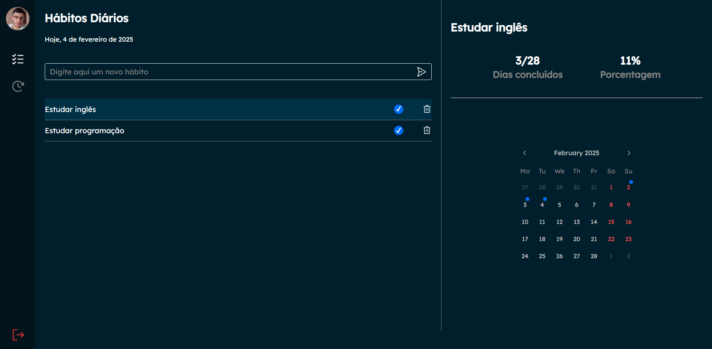
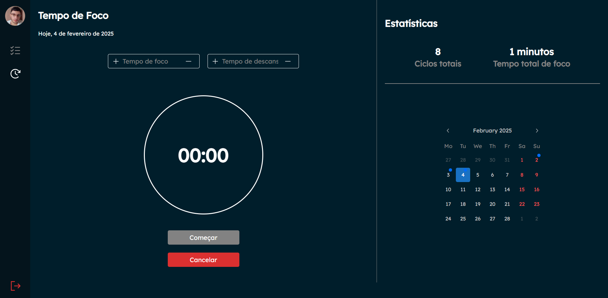

# EliteTracker - Front-End

## Descrição

O **EliteTracker** é um aplicativo para monitorar hábitos diários e auxiliar na gestão de produtividade. Desenvolvido com o objetivo de consolidar conhecimentos em **TypeScript**, este projeto também aprimorou minhas habilidades em **ReactJS** e outras tecnologias modernas.

A aplicação permite o registro e monitoramento de hábitos diários, com visualização das métricas em um calendário interativo. Além disso, possui um **temporizador de foco** e se integra a um banco de dados **MongoDB** para armazenar as informações. A autenticação dos usuários é feita através do **GitHub**.

## Funcionalidades

- **Monitoramento de hábitos diários**: Acompanhe suas métricas de produtividade.
- **Temporizador de foco**: Configure e registre sessões de foco.
- **Calendário interativo**: Visualize suas métricas no calendário.
- **Autenticação com GitHub**: Realize login com sua conta GitHub para acesso aos dados.

## Tecnologias Utilizadas

- **ReactJS**: Para construção da interface de usuário.
- **TypeScript**: Adiciona tipagem estática para maior segurança e escalabilidade.
- **CSS**: Estilização da interface.
- **@mantine/core**: Biblioteca de componentes UI modernos e responsivos.
- **React Router DOM**: Gerenciamento de rotas na aplicação.
- **Axios**: Para realizar requisições HTTP à API.
- **Day.js**: Manipulação de datas e visualização no calendário.
- **GitHub OAuth**: Autenticação de usuários via GitHub.

## Instalação

### Requisitos

- Node.js (versão >= 18)
- npm (gerenciador de pacotes do Node.js)
- Docker (opcional, para ambiente de desenvolvimento)

### Passos para rodar localmente

1. **Clone o repositório**:

   ```bash
   git clone https://github.com/Allysson-ryan/EliteTracker-interface.git

   ```

2. **Acesse o diretório do projeto**:

   ```bash
   cd elitetracker-front

   ```

3. **Instale as dependências**:

   ```bash
   npm install

   ```

4. **Inicie o servidor de desenvolvimento**:

   ```bash
   npm run dev
   ```

# Screenshot

Aqui temos a captura de tela do projeto:


